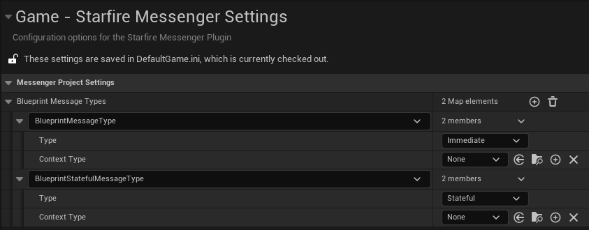
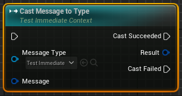

# Starfire Messenger

## General Description

Provides a World Subsystem that acts as a generalized message bus and provides highly decoupled method of broadcasting messages across a project.

This is very similar the Gameplay Message Router plugin that can be found in Epic's Lyra example project. The most significant difference between this implementation and Epics is to not separate the message data (structures) from the identifier (a gameplay tag). This sort of separation results in issues with both the broadcasting and receiving of messages, importantly around the ability to know how the structure data is supposed to map to the identifier. There's no guarantee that any specific tag will come with a specific structure type or that specific message data will be sent for a specific tag.
Having used a similar system in a prior project, it was somewhat difficult to maintain and scale poorly with team size (or even just over time with a single developer). On the next project, I was able to do a "better" version that used the type of the message data as the message identifier. By combining the two it made it much easier to know what to listen for, what data to expect. The downside of the system was that messages were UObjects that needed to be allocated, initialized, etc, but there wasn't a better option at the time.
With the introduction of InstancedStructs, it seemed possible to build the same system with fewer downsides. At first I was excited to see the Gameplay Message Router in Lyra and how it was able, through the use of Instanced Structs, to flexibly send structures between senders and receivers. I was saddened to see it was implemented using the separated id/data paradigm that I had already moved beyond, but was excited to have the chance to use the Instanced Structs in the same way that I was able to use UObjects. I was hoping to have a chance to write something at my work, but it didn't work out that way.
I kept seeing variations of the Lyra version shared in places online and finally after seeing one shared on Reddit I decided I needed to write the version I'd want to actually use.

## Detailed Description
* Broadcasting: Anything with access to the subsystem can send messages
* Listening:	Anything with access to the subsystem can receive the messages that were sent through it
* Struct-Based: Events are implemented by creating UStructs in C++ or Blueprint
				Both the Listeners and Broadcasters use the structure type as the identifier for message types
				The data for the message is the members of the struct
				Every message must be a unique structure, which provides a strict contract between the type of message and the content associated with the message
* Decoupled:	Broadcasters and listeners only need to know about the message structure in order to communicate; this allows very loose coupling between the two sides 
				as opposed to using methods like multi-cast delegates that force a listener to dig into the broadcaster creating dependencies
* Statefulness: The system allows messages to "fire and forget", but also allows for them to maintain state and be cleared when needed
				This allows the system to provide an easy way to handle "join in progress" situations where a listener needs to know that an message has already occurred and to get
				access to the data & context that comprised it.
				- Only make messages "stateful" if you need them to be. Don't use the system as a crutch to solve all your edge case needs. Being "stateful" costs memory, and even
				  though everything is fairly efficient, it can eventually add up.				  
* Hierarchical: When listening for message types, listeners will also receive messages of child types
				In both C++ and Blueprint, there are alternate params that allow for determining the actual message type safely if that is needed
				- A macro (`SET_MESSAGE_TYPE_AS_ABSTRACT`) is provided to configure messages types that are meant to act as a parent type, can be listened for but should not be broadcast directly.
				- Parent types do not _have_ to be abstract, but the support is provided for the cases where it is desirable.
				- Since there is no way to provide a base type for blueprint messages, hierarchical listening with them is not supported nor is there a way to mark them abstract.
				- Blueprint can still listen hierarchically to messages defined in C++.

Future work for this plugin can be found [here](https://open.codecks.io/starfire/decks/43-starfire-messenger), but there is no timeline for when this work may be addressed.
Pull requests and feature requests are happily accepted.

## Dependencies

In addition to the dependencies on plugins from the Engine, Starfire Messenger is also dependent on the Starfire Utilities plugin found in this repository. These dependencies are actually fairly minor: _TypeUtiliesSF.h/hpp/cpp_ and _StarfireK2Utilities.h/cpp_. These files could be copied from Starfire Utilities instead of using the plugin entirely.

To provide a reasonable amount of type safety in blueprint for hierarchical messages, the [MDMetaDataEditor plugin](https://github.com/DoubleDeez/MDMetaDataEditor) by Dylan Dumesnil has been directly included in the StarfireMessenger plugin. If you have that plugin installed separately, you can remove it from Messenger and it will work just fine (you'll need to update the uplugin appropriately as well). You will just have to add a new project setting entry for Instanced Structs for a string type named "BaseStruct" and a new entry for ExposeOnSpawn that supports structures (these can be copied to your DefaultEditor.ini from below). You can ignore the meta-data if you want, the 'Register for Message' will prepopulate it if you use it to create new functions/events. However the plugin allows user editing if you need to go back or change your mind, or are creating the functions/events manually.

```
+MetaDataKeys=(Key="BaseStruct",KeyType=String,Description="The minimum allowable type holdable by this struct.",Category="",RequiredMetaData="",IncompatibleMetaData=(),SupportedBlueprints=("/Script/Engine.Blueprint"),SupportedPropertyTypes=((PropertyType="struct",PropertySubTypeObject="/Script/CoreUObject.InstancedStruct",PropertySubTypeMemberReference=(MemberGuid=00000000000000000000000000000000),ValueType=None)),bCanBeUsedByFunctions=False,bCanBeUsedByStructs=False,bCanBeUsedOnVariables=True,bCanBeUsedOnLocalVariables=True,bCanBeUsedOnFunctionParameters=True,bAllowSlider=True,MinInt=-2147483648,MaxInt=2147483647,MinSliderInt=0,MaxSliderInt=100,MinFloat=-340282346638528859811704183484516925440.000000,MaxFloat=340282346638528859811704183484516925440.000000,MinSliderFloat=0.000000,MaxSliderFloat=100.000000,ValueList=,bUseDisplayNameOverride=False,DisplayNameOverride="")

+MetaDataKeys=(Key="ExposeOnSpawn",KeyType=Boolean,Description="",Category="",RequiredMetaData="",IncompatibleMetaData=(),SupportedBlueprints=("/Script/Engine.Blueprint"),SupportedPropertyTypes=((PropertyType="wildcard",PropertySubTypeMemberReference=(MemberGuid=00000000000000000000000000000000),ValueType=None)),bCanBeUsedByFunctions=False,bCanBeUsedByStructs=False,bCanBeUsedOnVariables=True,bCanBeUsedOnLocalVariables=False,bCanBeUsedOnFunctionParameters=False,bAllowSlider=True,MinInt=-2147483648,MaxInt=2147483647,MinSliderInt=0,MaxSliderInt=100,MinFloat=-340282346638528859811704183484516925440.000000,MaxFloat=340282346638528859811704183484516925440.000000,MinSliderFloat=0.000000,MaxSliderFloat=100.000000,ValueList=,bUseDisplayNameOverride=False,DisplayNameOverride="")
```

### Epic

To make the custom nodes work as required, [a modification](https://github.com/EpicGames/UnrealEngine/pull/11771) is required to an Engine node. To prevent users from having to also modify their engine, some nodes have been duplicated and renamed in order to support the plugin nodes. They've been modified so that they shouldn't interfere with normal use of blueprints, even though there are technically two of the same kind of node type present. These duplicates will be removed if/when the associated pull requests are merged into the Engine.

## Detailed Usage

### Creating Message Types
In C++ you can create new message types by deriving from `FSf_Message_Immediate` or `FSf_Message_Stateful`.
The `SET_MESSAGE_TYPE_AS_ABSTRACT` macro can be used with either type to mark message types that shouldn't be broadcast directly.
The `SET_CONTEXT_TYPE` macro can also be used by either type to indicate a specific type of object that will be related to the broadcast.
	- Derived types can redeclare context types, but should only become _more_ specific. `FTestStatefulContext_C` in the following example could choose a type derived from `APawn` but should not choose a type like `AActor`.
	- Context type can be declared const (`SET_CONTEXT_TYPE( const USomeAssetType )`) for cases where the context should never be modifyable by handlers, such as when the context is an asset type.
	- Even if the message declares the context type as non-const, handler functions can define the context parameter as const if that handler's intent is to not modify the context.
The `SET_CONTEXT_NAME` macro can be used to customize the blueprint name of context pins.
Properties can optionally be declared as BlueprintReadOnly if they are going to read in blueprint.
Properties can optionally be declared as ExposeOnSpawn if they are going to be broadcast from blueprint.

```
USTRUCT( )
struct FTestImmediateNoContext : public FSf_Message_Immediate
{
	GENERATED_BODY( )

	UPROPERTY( BlueprintReadOnly, meta=(ExposeOnSpawn))
	int Test1;
};
SET_MESSAGE_TYPE_AS_ABSTRACT( FTestImmediateNoContext );

USTRUCT( )
struct FTestImmediateNoContext_C : public FTestImmediateNoContext
{
	GENERATED_BODY( )

	UPROPERTY( BlueprintReadOnly, meta=(ExposeOnSpawn))
	int Test2;
};

USTRUCT( )
struct FTestStatefulContext : public FSf_Message_Stateful
{
	GENERATED_BODY( )

	SET_CONTEXT_TYPE( APawn )
	SET_CONTEXT_NAME( "Pawn" )
	
	UPROPERTY( BlueprintReadOnly, meta=(ExposeOnSpawn))
	int Test1;
};
SET_MESSAGE_TYPE_AS_ABSTRACT( FTestStatefulContext );

USTRUCT( )
struct FTestStatefulContext_C : public FTestStatefulContext
{
	GENERATED_BODY( )
	
	UPROPERTY( BlueprintReadOnly, meta=(ExposeOnSpawn))
	int Test2;
};
```

In Blueprint, you can create new structures through the Editor as normal.


Marking the properties as 'ExposeOnSpawn'.


And adding them to the Project Settings for *Starfire Messenger*.
Here you can select which type (*Immediate* or *Stateful*) and the Context Type.



Abstract and derived message types are not supported for Blueprint messages.

### Messenger Subsystem
Accessing the Messenger Subsystem is very straight forward in both C++ and Blueprint.

C++ provides a static function that takes a WorldContext object and returns the subsystem:
`UStarfireMessenger* Messenger = UStarfireMessenger::GetSubsystem( WorldContext );`

Blueprint uses the built-in subsystem accessor node:


### Broadcasting Messages

Messages can be broadcast in C++ through a robust collection of template functions.
The simplest version is declaring message instances, populating them (through constructors and member assignments) and then calling Broadcast
```
FTestImmediateNoContext_C Message( ... );
...
Messenger->Broadcast( Message );
```
or if a Context type is specified, a context parameter is required
```
FTestStatefulContext_C Message( ... );
...
Messenger->Broadcast( Message, MessageContext );
```

Designated initializers are supported (assuming designated initializers work for the message type already)
```
FTestImmediateNoContext_C = { .Test1 = 42, .Test2 = 3.14f );

Messenger->Broadcast< FTestImmediateNoContext_C >( { .Test1 = 42, .Test2 = 3.14f } );
```
and if a Context type is specified, a context parameter is again required
```
FTestImmediateNoContext_C = { .Test1 = 42, .Test2 = 3.14f );

Messenger->Broadcast< FTestImmediateNoContext_C >( { .Test1 = 42, .Test2 = 3.14f }, MessageContext );
```

Another simple alternative is also available.
Broadcast can also be called and passed constructor parameters directly similar to `TArray::Emplace`
```
FTestImmediateNoContext_C( int Test1, float Test2 );

Messenger->Broadcast< FTestImmediateNoContext_C >( 1, 2.0f );
```
and if a Context type is specified, a context parameter is again required (except as the first parameter)
```
FTestStatefulContext_C( int Test1, float Test2 );

Messenger->Broadcast< FTestStatefulContext_C >( MessageContext, 1, 2.0f );
```
(Note: declaring a constructor no longer allows designated initializers to be used to construct the message. That's just C++.)

Blueprint provides a single Broadcast node:


The message type can be selected through the Message Type pin (listing any native message type or blueprint type listed in the Project Settings):


Selecting a Message Type allows the ability to set all the members of the message (which should be marked as ExposeOnSpawn) as well as Context (if the message type requires it)


### Message Listening

In C++, messages can be listened for through another suite of template functions and overloads.
These can be a bit overwhelming, but they have been setup to get the compiler/IDE to catch mismatches as quickly as possible.

For regular listening, either a `TFunction< void( FMessageType& ) >` or member function that takes the message structure. The use of a `TFunction` allows a wide variety of handlers like static function and lambdas.
```
void Handler( const FTestImmediateNoContext_C& );
static void HandlerStatic( const FTestImmediateNoContext_C& );

Messenger->StartListeningForMessage( this, &UClassName::Handler );
Messenger->StartListeningForMessage< FTestImmediateNoContext_C >( &HandlerStatic );
```
Note that the member function version can deduce the template type, while the TFunction one can't. One potential coding style suggestion would be always be explicit with this template parameter.

For message types that have a context, the signature expands to require the context parameter.
```
void Handler( const FTestImmediateContext_C&, APawn* );
static void HandlerStatic( const FTestImmediateContext_C&, APawn* );

Messenger->StartListeningForMessage( this, &UClassName::Handler );
Messenger->StartListeningForMessage< FTestImmediateContext_C >( &HandlerStatic );
```
And you can also specify a context filter when you start listening as the only context you want messages from:
```
APawn* OnlyThisContext = ...

Messenger->StartListeningForMessage( this, &UClassName::Handler, OnlyThisContext );
Messenger->StartListeningForMessage< FTestStatefulContext_C >( &HandlerStatic, OnlyThisContext );
```

Stateful messages also provide an enumeration value that indicates the statefulness of the message being recieved.
This parameter comes after the message structure (for non-contextual messages) or after the context (for messages with one).
```
void HandlerNoContext( const FTestStatefulNoContext_C&, EStatefulMessageEvent );
void HandlerContext( const FTestStatefulContext_C&, APawn*, EStatefulMessageEvent );
```

In Blueprint, two different nodes are provided to respond to broadcast messages.

"Register for Message" is a node that allows you to select another function or event to be called when the message occurs.
Function signature rules are the same as in C++ where the first parameter is the message structure followed by the (optional) context and the (optional) statefulness enumeration.


The drop down allows you to select from the class's functions/events that have a matching signature and will include both C++ & Blueprint functions of the class.
The drop down also provides helpful options for creating new functions or events which will become the selected target to call when the message occurs.


An async node is also provided that allows responding to broadcasts directly inline without the need for a handler function.
There are two varieties, one for Immediate mode messages and one for Stateful messages.
In the case of Stateful messages, the statefulness enumeration is converted directly into separate execution pins.


In both cases, the nodes also support a Context Filter input pin which acts identically to the context filter in C++.

### Hierarchical Message Listening

One of the key features of this messenging system is the ability to listen to families of messages and not just individual messages.

All of the previously mentioned methods of listening for messages will work hierarchically, and by that it means that if you listen for `FTestImmediateNoContext` you will also receive the messages for any child type of that message type. This is why you can listen for abstract message types even though they can't be broadcast.

However it is not always useful to have instances of only the base type. When using UObjects, the use of Cast/CastChecked is fairly ubiquitious but that sort of dynamic typing isn't available by default with structures.

In C++ this can be worked around by the use of struct views and adds one more variation to the message handlers:
```
void Handler( const TConstStructView< FTestImmediateNoContext >& Message );
void Handler( const TConstStructView< FTestImmediateContext >& Message, APawn* );
void HandlerNoContext( const TConstStructView< FTestStatefulNoContext >& Message, EStatefulMessageEvent );
```
and child types can be extracted through use of the `TConstStructView::GetPtr` API.
```
const FTestImmediateNoContext_C* Maybe_C = Message.GetPtr< FTestImmediateContext_C >( );
```

Unfortunately, this solution is not directly available to Blueprint and instead the system relies on Instanced Structs.

Instanced Structs are a struct that can act as a structure of any type and attempt to provide versions of itself of related types.
To get the best use from Instanced Structs, you should set the "BaseStruct" metadata (which is what the MDMetaDataEditor plugin is included to support)

The good news is that if you use the 'Create matching hierarchical function/event' option of 'Register for Message' or use the 'Listen Hierarchically' checkbox of 'Listen for Message' this is all taken care for you!

From there, you can use the provided 'Cast Message' node to convert the Instanced Struct parameter to the message type of your choice.



This node functions identically to the cast node used with objects, except for fact that the desired type is selected through a pin drop down instead of there being separate nodes for each type.

The 'BaseStruct' meta is used to limit the cast node's drop down to the potentially relevant message types. If it's not set (because you created the function yourself) or you removed it, no worries. It will still work as expected, you'll just have a larger list of types to choose from. Some of which might never be able to succeed.

## Components

### Runtime

#### Messenger Subsystem
_Messenger.h/hpp/cpp_

The world subsystem that acts as the centralized message handler.

_MessageTypes.h/cpp_

Header with the message types that should be used as the base for any message defined in C++.

_MessengerTypes.h/cpp_

Header with utility types used to interact with the Messenger subsystem like `EStatefulMessageEvent` and the Listener handle.

#### Project Settings
_MessengerProjectSettings.h/cpp_

A developer settings that projects can use to configure how Messenger treats blueprint structures, setting the type (stateful or immediate) and the context type which can't be set the same way as it can be for C++ structures.
The expectation is that most message types are defined in C++ where types can be discovered through reflection. There is no way to determine if a blueprint struct is meant to be a message or not, and so requires an extra step to "register" them. Structures not in this list (or defined in C++) will not be available from the dropdowns on the various blueprint nodes to interact with message data (broadcast/listen/etc).

#### Unit Tests
_CompileTests.h/cpp_

An actor that functions as a unit test for the variations of handlers to double check compilation of the overloads of StartListeningForMessage. Both the cases that are expected to work as well as the ones that are expected to generate compile errors (but those are disabled by default).

### Developer

#### Custom K2 Nodes

This module has all the custom blueprint nodes which provide the nodes for working with the Messenger Subsystem from blueprint.

This module also has all the duplicated Epic blueprint nodes to handle the customization required to make them work.

### Editor

There is currently nothing in this module, it is a placeholder for future features that need this module type.
