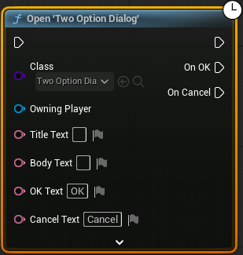

# Starfire UI

## General Description

A general collection of UI related support code.

I'm not 100% sure this plugin is super useful to anyone else, but it collects a bunch of UI stuff that I use across all my hobby projects as a basis for my UI.
Maybe it's useful for others to drop into projects (or use on a new project). Maybe it's just helpful as an example.

A lot of it is a bit of boilerplate that I didn't want to have repeated in each of my multiple projects.

Future work for this plugin can be found [here](https://open.codecks.io/starfire/decks/49-starfire-ui), but there is no timeline for when this work may be addressed.
Pull requests and feature requests are happily accepted.

## Detailed Description

### UI Policy and Layout
The UI Layout mechanism from CommonGame is really powerful, but I kept making the same thing in each project.

Starfire UI Layout is a layout entirely in native (making it a little easier to reuse across projects) and default UI Policy asset that the project can configure itself with to use that layout.

The default layout consists of 4 layers with tags defined in native directly on the layout. More layers can be added by modifying the Layer Names property. There's more work that would make this more flexible however.
Creating blueprint children doesn't work very well and you can't mix layers with other widgets (like Named Slots) which can be very useful.

The layout also include a Fade widget on top of all the layers (discussed in more detail further down) and a custom "negative space" widget that is used to track the mouse and whether it is over widgets or over the game world.
There are lots of times where you don't want to update something in the game world (like a cursor) when the mouse is actually over HUD elements and that is what this is meant to support.

### HUD
The Starfire HUD and HUD Widget handle a few common game things.

First, it provides a consistent way that the widget gets created and pushed to the layout, specifically the UI.Layer.Game layer stack.

Second, it uses configuration from the HUD Widget to initialize a custom input subsystem to the desired defaults.

Third, it adds its own hook into the input to handle opening a pause menu (a widget type that is configurable on the Starfire HUD class) to the UI.Layer.Menu layer stack.

### Fader
While the engine does have a way to fade, the camera fades have an annoying behavior of only fading out the game world and not UI.
So I usually end up building a custom fader anyway that's UI based and on top of all the other UI.

The UI Layout has made this a whole lot easier than it has in the past since the layout provides a very reliable way to place a fade on top of every other widget.

A widget is built into the layout and there is a subsystem that controls it's opacity. There are also a couple of async actions for handy ways to sequence fades with other logic.
This widget is just an image tinted black, but I'd like to make that more configurable and allow a custom widget.

### Screens and Dialog Boxes
While they aren't particularly complicated, screens and dialog boxes have a tendency to be a real annoyance to manage.

The StarfireScreen base widget class, adds and OnOpen & OnClose API on top of the the common activable widget activation. This still needs some improvement to put some time in between the Activation hooks and the Open/Close hooks.
Screens are intended for self contained UI's that, while they may update the game state, what happens in the screen isn't directly relevant to the client that decided to open it.

A child of Starfire Screen, Starfire Dialog is a specialized widget that specifically is trying to get information from a player.
They are intended to be modal and the UI.Layer.Modal is the default destination layer for them.

A custom blueprint node is available which leverages any 'Expose on Spawn' and delegate properties or event delegates to provide a really convienent way to slot these sort of modal dialogs into the flow of a UI.

This is an example of the custom blueprint node opening a dialog box with two options.


### Text Injection
A very involved mechansim to replace portions of text in a string with gameplay values at runtime.

At a high level, the goal of this code is to take 1) a user facing string like "Deal {AtkStat} damage to {Target}.", 2) a 'Resolver', an object that implements the Text Tag Resolver interface, and 3) some additional context information and produce a string like "Deal 20 damage to Robert.".
The Resolver might be the character doing the attacking, and one of the contexts would be the characer being attacked.

A detailed description of how it works is in a comment block at the bottom of _TextInjectionUtilities.h_.

### Display Param Interface
An interface that provides a common API for object display data.
Things like display name, description and icons.

Also has some macros that make it easy to forward implementations of the interface to another object that implements the same interface function (through an accessible `GetDefinition` method).
My implementations usually involve an object that forwards to an associated `UDataDefinition` asset (from my Starfire Assets plugin), hence the function name the macro looks for and the names of the macros.

There's one macro for every function of the interface, and a single macro that will handle every function. 

### Custom Widgets
Two custom widgets are provided in this plugin `UStarfireButton` and `UStarfireActivatableWidget`.

`UStarfireButton` is derived from `UButton` and provides additional delegates to those from the base class.
For each Button delegate, there is an SF-suffixed version. The difference is that the SF delegate has a parameter which is the button which raised the event.
This is useful when it is desirable to bind the same callback to multiple widget instances.
It also has two helper functions for updating the image and tint that is applied to the button to all the different button states.

`UStarfireActivatableWidget` is derived from `UCommonActivatableWidget` and provides an implementation of `UCommonActivatableWidget.GetDesiredInputConfig` with the help of a couple of new properties that allow the widget to configure the input behavior of the widget.

### Input Subsystems
Two input subsystems are made available that extend the EnhancedInputLocalPlayerSubsystem and EnhancedInputWorldSubsystem.
They extend the functionality of the Input Modes of Input Mapping Contexts by providing way to control the current controls by pushing and popping to a stack.
It doesn't remove any of the ability to just directly modify the input mode (which ultimately just modifies the top of the stack).

These extension subsystems are disabled by default and can be enabled with a config value in DefaultGame.ini.
```
[/Script/StarfireUI.StarfireInputLocalPlayerSubsystem]
bStarfireInputEnabled=True
```
This is because the EnhancedInputLocalPlayerSubsystem & EnhancedInputWorldSubsystem subsystems aren't really designed to be derived from.
You will need to update the Enhanced Input subsystems to not be created during subsystem initialization. The easiest way is to mark both subsystems as `Abstract`. Or you could apply [this 'Closed' PR](https://github.com/EpicGames/UnrealEngine/pull/13586) to your souce build

### Utilities
A blueprint function library is available that provides a few functions I've found helpful.

First is a utility for quickly accessing the widget that was created by the HUD actor. This function, of course, assumes that you've used the StarfireHUD & StarfireHUDWidget classes as parents for the projects implementation of its HUD.

Another function is provided for checking the state of the mouse and whether it is over UI widgets or hovering over the view of the game. This utility does rely on the use of the StarfireHUDWidget and the StarfireUILayout.

Lastly is a utility that can be used to dynamically create `UWidget` class widgets. The 'Create Widget' node available to blueprint only allows the creation of `UUserWidget` widgets which can, at times, be somewhat limiting.
I found this to be a more practical solution than creating blueprint widgets that just wrap `UWidget` instances.
The downside is the lack of the nice 'Expose On Spawn' initialization input pins, so it's not a universal replacement for anything. Just a handy, sometimes, tool.

## Dependencies

In addition to the dependencies on plugins from the Engine, Starfire Messenger is also dependent on the Starfire Utilities & Assets plugins found in this repository.
The Utilties dependency is fairly minor and could be copied from NativeGameplayTags_SF.h instead of using the plugin entirely.
The Assets dependency is fairly easily disabled if you're not using Starfire Assets, with very little impact on functionality.

There are also dependencies on the CommonGame and ModularGameplayActors plugins from Lyra, Epic's sample project.
The CommonGame dependency is fairly integral to the UI support in the plugin.
ModularGameplayActors is easily removed by reparenting or removing StarfireHUD.

## Components

### Runtime
_StarfireUIManager.h/cpp_, _StarfireUIPolicy.h/cpp_, _StarfireUILayout.h/cpp_, _StarfireUIPolicy_BP_

Implementations of a UI Manager, UI Policy and UI Layout.

_StarfireHUD.h/cpp_, _StarfireHUDWidget.h/cpp_

Implementations of a HUD and HUD Widget. The HUD will create and push its widget to the "UI.Layer.Game".

_StarfireFader.h/cpp_, _StarfireFader_Async.h/cpp_

Subsystem & async actions for controlling the fader widget built into the UI Layout.

_StarfireScreen.h/cpp_, _StarfireDialog.h/cpp_

Bases classes for `UStarfireScreen` and `StarfireDialog` UI classes.

_TextInjectionShared.h/cpp_, _TextInjectionUtilities.h/cpp_, _TextTagResolver.h/cpp_

Interface and utility functions/data to support text injecton algorithm.

_DisplayParamInterface.h/cpp_

Interface for common display data.

_StarfireButton.h/cpp_

Custom `UButton` implementation.

_StarfireActivatableWidget.h/cpp_

Custom `UCommonActivatableWidget` implementation.

_StarfireInputSubsystems.h/cpp_, _StarfireInputSubsystemTypes.h/cpp_

Implementations of EnhancedInputLocalPlayerSubsystem and EnhancedInputWorldSubsystem.

_StarfireUIStatics.h/cpp_

A function library with a few helpful functions.

### Developer
_K2Node_StarfireOpenDialog.h/cpp_

The custom blueprint node that supports asynchronous interactions with Starfire Dialog classes.

### Editor
There is currently nothing in this module, it is a placeholder for future features. This is a placeholder for future features that need this module type.